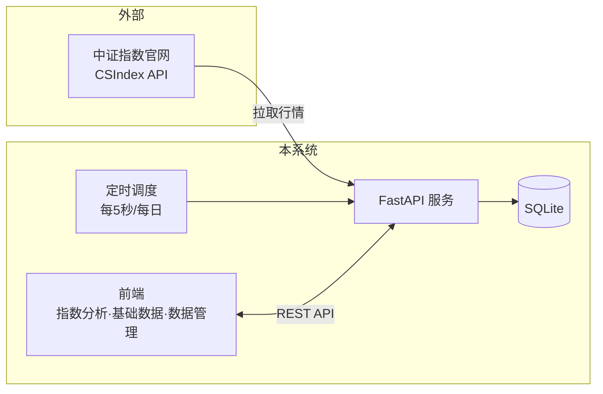
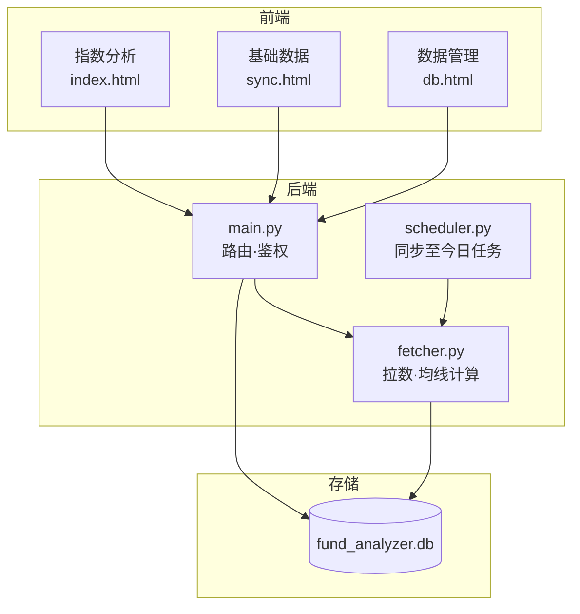
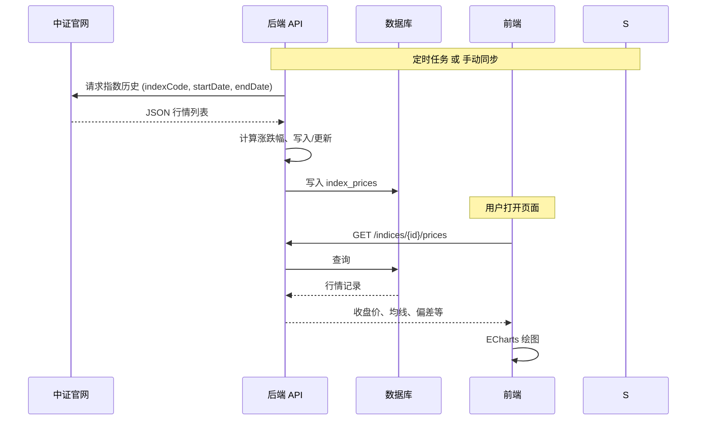
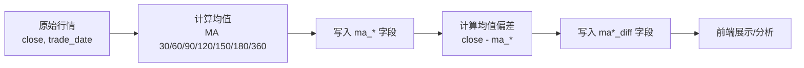
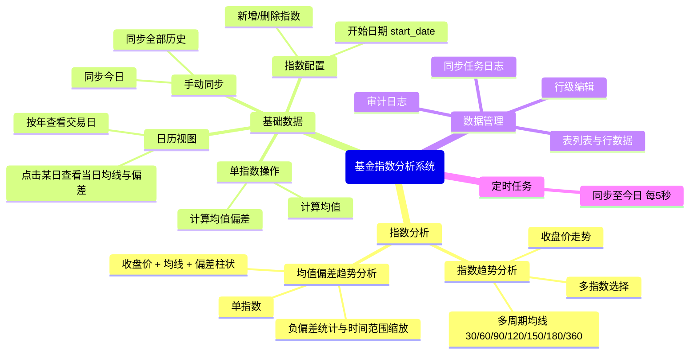
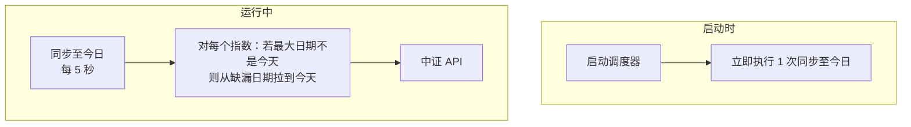
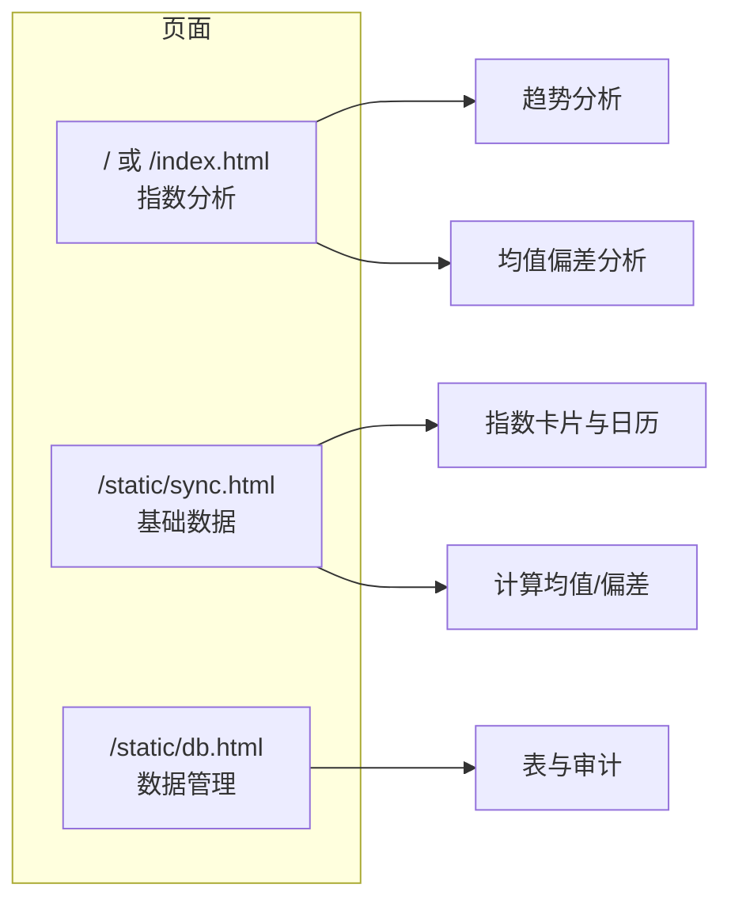
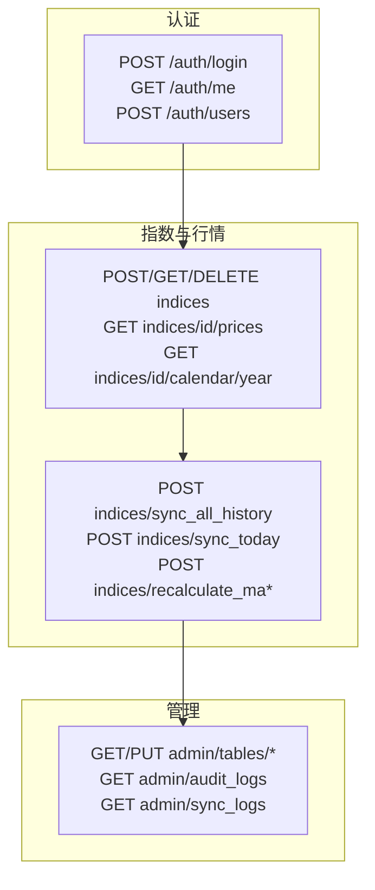
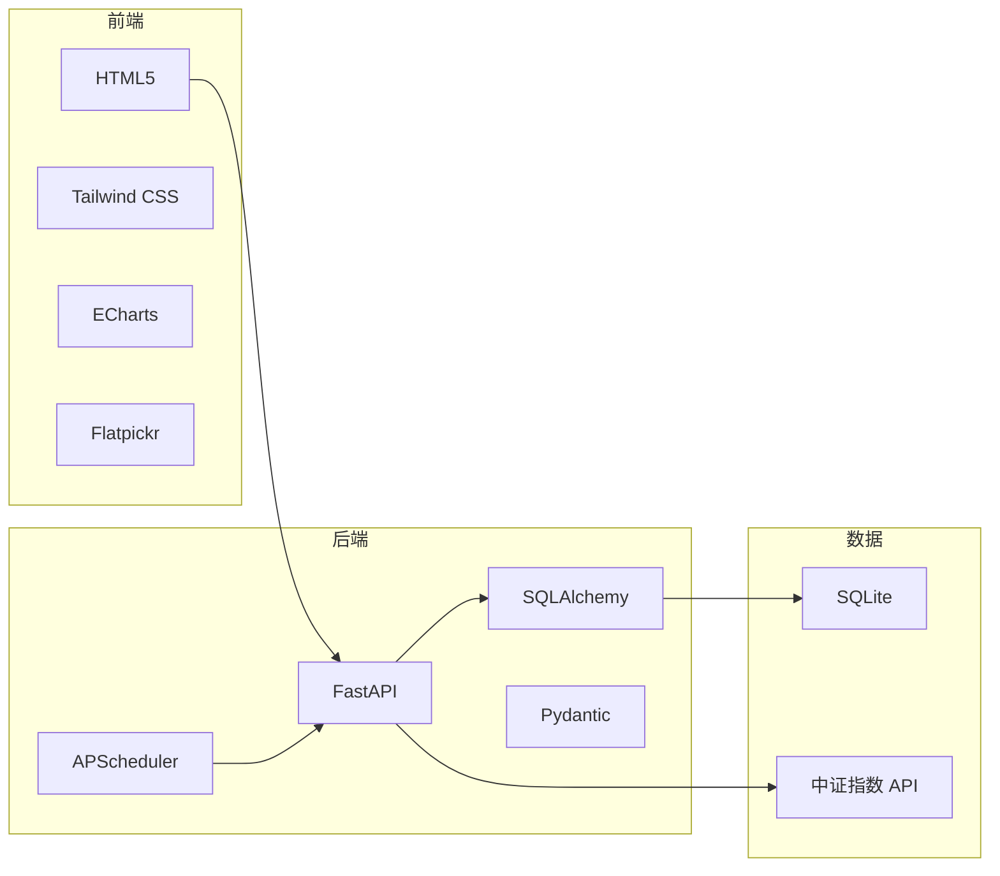

# 基金指数分析系统 · 能力简介

## 一、系统概览

本系统用于**指数行情采集、存储与可视化分析**，支持多指数配置、历史数据拉取、均线/均值偏差计算，以及定时同步至今日。



---

## 二、整体架构



---

## 三、数据流

### 3.1 行情数据从采集到展示



### 3.2 均线与均值偏差的计算流程



均线和偏差**不在拉数时自动算**，需在「基础数据」页对单指数或全部指数点击「计算均值」「计算均值偏差」触发。

### 3.3 美股指数（FRED + Alpha Vantage）

- **数据源（二选一或同时配置）**：
  - **[FRED](https://fred.stlouisfed.org/)**：配置 `FRED_API_KEY`（[免费申请](https://fred.stlouisfed.org/docs/api/api_key.html)），可拉取完整历史与最新价。
  - **[Alpha Vantage](https://www.alphavantage.co/)**：配置 `ALPHA_VANTAGE_API_KEY`（[免费申请](https://www.alphavantage.co/support/#api-key)），免费档约返回最近 100 个交易日；当 FRED 无数据时会自动尝试 Alpha Vantage。
- **支持的指数代码**：`NASDAQCOM`（纳斯达克综合）、`SP500`（标普500）、`DJIA`（道琼斯工业平均）。在「基础数据」中**新增指数**时，代码填上述之一即可拉取历史并参与定时同步。
- **接口**：`GET /us-indices/quote` 返回上述美股指数的最新净值，优先 FRED，无数据时用 Alpha Vantage。

---

## 四、功能模块总览



---

## 五、定时任务



- **统一任务**：每 5 秒执行一次。对每个指数，若最大数据日期不是今天，则从「最大日期+1」或 start_date 开始拉取，直到更新到今天；已是今天则跳过。

---

## 六、核心数据模型（简化）

```mermaid
erDiagram
    indices ||--o{ index_prices : "has"
    indices {
        int id PK
        string code UK
        string name UK
        date start_date "可选"
    }
    index_prices {
        int id PK
        string index_code
        date trade_date
        float close
        float change_pct "涨跌幅"
        float pe_ratio "市盈率"
        float ma_30 .. ma_360
        float ma30_diff .. ma360_diff
    }
    sync_job_logs {
        string job_type
        string status
        datetime finished_at
    }
```

---

## 七、前端页面与入口



| 页面     | 路径               | 主要能力 |
|----------|--------------------|----------|
| 指数分析 | `/`                | 多指数趋势对比、均线开关；单指数均值偏差趋势与统计 |
| 基础数据 | `/static/sync.html`| 指数增删、开始日期、单/全量计算均线与偏差、日历视图、同步 |
| 数据管理 | `/static/db.html`  | 表浏览、行编辑、审计日志、同步任务日志 |

---

## 八、API 能力概览



- **指数**：增删改查、按指数查行情、按年查日历数据。
- **同步与计算**：手动同步全部历史/今日、全部或单指数计算均值与均值偏差。
- **管理**：表数据、审计日志、同步任务日志（均支持分页等）。

---

## 九、技术栈简图



---

以上为系统能力简介，**多用图**展示架构、数据流、功能分布、定时任务与数据模型，便于快速理解与对外说明。
